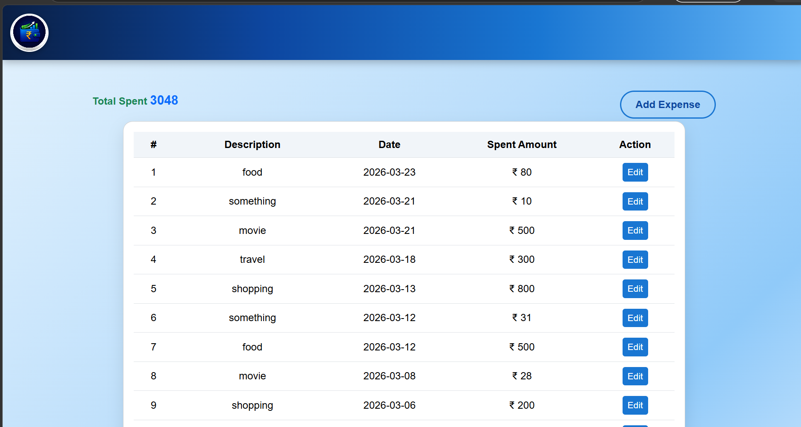

# Expense Tracker

A simple and clean web-based expense tracker that helps users manage and monitor daily spending.

## Features
- Add and edit expenses
- View total spending in real-time
- Clean and responsive user interface
- Data stored using browser localStorage

## Tech Stack
- HTML  
- CSS (Bootstrap)  
- JavaScript (jQuery)

## How it Works
- Users can add expenses with description, date, and amount  
- Data is stored locally in the browser  
- Expenses are displayed in a dynamic table  
- Total spending is calculated automatically  

## Screenshots

## Author
Procheta Ray
